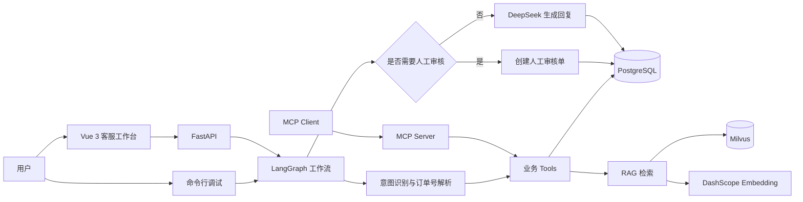

# 企业级电商智能客服 Agent

一个面向电商客服场景的 Agent 应用原型。项目使用 LangGraph 编排订单查询、物流查询、退款售后、企业知识库检索和人工审核流程，并通过 FastAPI 与 Vue 3 提供可交互的客服工作台。

它不只是“文档检索后让大模型回答”的基础 RAG Demo，而是将结构化业务数据、向量知识库、规则决策、大模型生成和人工审核组合成一条可追踪的客服处理链路。

## 核心能力

- 基于 LangGraph 的客服工作流与条件路由
- 订单、物流、退款和售后数据查询
- 基于 Milvus 与 DashScope Embedding 的企业知识库 RAG
- 无订单号的发票、物流政策、退款政策等知识问答
- 基于 `session_id` 的多轮对话与订单上下文继承
- 质量争议、投诉和高风险退款的人工审核分流
- 会话记录、审核记录和 Agent 执行轨迹持久化
- FastAPI 接口与自动生成的 Swagger 文档
- Vue 3 客服工作台：聊天、审核、轨迹、知识库和系统状态
- MCP Server：将业务查询能力暴露为标准 MCP Tools
- DeepSeek 调用失败时的规则化降级回复

## 系统架构



## Agent 执行流程

```text
用户消息
  -> 创建或恢复会话
  -> 识别意图并解析订单号
  -> 根据会话历史恢复上一轮订单上下文
  -> 查询订单、物流和退款记录
  -> 检索企业政策知识库
  -> 组装可信业务上下文
  -> 判断是否需要人工审核
       -> 需要：创建审核单并返回审核单号
       -> 不需要：调用 DeepSeek 生成客服回复
  -> 保存会话消息与完整执行轨迹
```

纯知识库问题（例如“发票怎么开”）不要求用户提供订单号，可直接进入 RAG 检索和回复生成流程。

## 技术栈

| 模块 | 技术 |
| --- | --- |
| Agent 编排 | LangGraph、LangChain |
| 大模型 | DeepSeek |
| Embedding | DashScope `text-embedding-v3` |
| 向量数据库 | Milvus |
| 关系数据库 | PostgreSQL、Psycopg 3 |
| 后端 | FastAPI、Pydantic Settings、Uvicorn |
| 前端 | Vue 3、Vite |
| 工具协议 | MCP Python SDK、FastMCP |

## 项目结构

```text
.
├─ agent/                       # Agent 调用入口
│  └─ customer_service_agent.py
├─ api/                         # FastAPI 应用、路由与数据模型
│  ├─ routes/
│  ├─ app.py
│  ├─ exceptions.py
│  ├─ response.py
│  └─ schemas.py
├─ config/                      # 模型、数据库与环境配置
├─ database/                    # PostgreSQL 初始化与 Repository 层
├─ data/knowledge/              # 企业政策知识文件
├─ frontend/                    # Vue 3 客服工作台
├─ graph/                       # LangGraph State、Nodes 与 Workflow
├─ mcp_server/                  # MCP Server
├─ rag/                         # 文档入库与向量检索
├─ tools/                       # 订单、物流、退款、知识库等业务工具
├─ main.py                      # 命令行调试入口
└─ requirements.txt
```

## 环境要求

- Python 3.10+
- Node.js `^20.19.0` 或 `>=22.12.0`
- PostgreSQL
- Milvus Standalone
- DeepSeek API Key
- DashScope API Key

本项目当前默认从 Windows 运行 Python、FastAPI 和 Vue，并连接虚拟机中通过 Docker 部署的 PostgreSQL 与 Milvus。也可以根据自己的部署环境修改连接地址。

## 快速启动

### 1. 获取项目并安装后端依赖

进入项目根目录，创建或激活 Python 虚拟环境后执行：

```powershell
python -m pip install -r requirements.txt
```

### 2. 配置环境变量

复制环境变量模板：

```powershell
Copy-Item .env.example .env
```

然后根据自己的服务地址、账号和密钥修改项目根目录下的 `.env`：

```env
DEEPSEEK_API_KEY=your_deepseek_api_key
DEEPSEEK_BASE_URL=https://api.deepseek.com

DASHSCOPE_API_KEY=your_dashscope_api_key

POSTGRES_HOST=192.168.245.128
POSTGRES_PORT=5432
POSTGRES_DB=customer_service
POSTGRES_USER=postgres
POSTGRES_PASSWORD=your_postgres_password

MILVUS_URI=http://192.168.245.128:19530
MILVUS_DB_NAME=customer_service_kb
MILVUS_COLLECTION_NAME=docs

RAG_TOP_K=3
RAG_MIN_RELEVANCE_SCORE=0.45
```

不要将包含真实密钥和密码的 `.env` 提交到 Git。

### 3. 启动基础服务

在部署 PostgreSQL 和 Milvus 的虚拟机中启动 Docker：

```bash
sudo systemctl start docker
```

启动 PostgreSQL 容器：

```bash
docker start postgres
```

在 Milvus Compose 文件所在目录启动 Milvus：

```bash
docker compose up -d
```

确认所有服务已经运行：

```bash
docker ps
```

预期至少可以看到 PostgreSQL、Milvus、etcd 和 MinIO 容器处于运行状态。请提前创建：

- PostgreSQL Database：`customer_service`
- Milvus Database：`customer_service_kb`

### 4. 初始化 PostgreSQL

```powershell
python -m database.init_db
```

成功时会看到：

```text
企业级智能客服数据库初始化完成
```

当前轨迹功能使用 `agent_traces.trace_steps` 保存 JSON 执行步骤。如果数据库中尚未包含该字段，请在 PostgreSQL 中执行一次：

```sql
ALTER TABLE agent_traces
ADD COLUMN IF NOT EXISTS trace_steps JSONB DEFAULT '[]'::jsonb;
```

### 5. 初始化 RAG 知识库

知识文件位于 `data/knowledge/`，当前包括发票、物流、退款和售后政策。

```powershell
python -m rag.ingest_knowledge
```

该命令会读取 `.txt` 文件、切分文本、调用 DashScope Embedding，并重新创建 Milvus Collection。成功后会输出文档数量、切分数量、向量维度和 Collection 名称。

### 6. 启动 FastAPI

```powershell
uvicorn api.app:app --reload --host 127.0.0.1 --port 8000
```

打开：

- Swagger 文档：<http://127.0.0.1:8000/docs>
- 健康检查：<http://127.0.0.1:8000/health>
- 系统自检：<http://127.0.0.1:8000/system/check>

### 7. 启动 Vue 3 工作台

新开一个终端：

```powershell
cd frontend
npm install
npm run dev
```

访问：<http://127.0.0.1:5173>

前端默认请求 `http://127.0.0.1:8000`。如需修改后端地址，可创建 `frontend/.env.local`：

```env
VITE_API_BASE_URL=http://127.0.0.1:8000
```

## 命令行调试

不启动 Vue 前端也可以直接测试完整 Agent 工作流：

```powershell
python main.py
```

推荐依次输入：

```text
DD10001物流到哪了
那这个订单多少钱
可以退货吗
发票怎么开
DD10001耳机左耳没声音，我想退款
```

前三个问题可以验证同一 `session_id` 下的订单上下文继承；最后一个问题会验证人工审核分流。

## API 示例

### 发起对话

```http
POST /chat
Content-Type: application/json
```

```json
{
  "message": "DD10001物流到哪了",
  "session_id": null
}
```

首次请求会返回新的 `session_id`。继续对话时应把同一个 `session_id` 传回后端：

```json
{
  "message": "那这个订单多少钱",
  "session_id": "session-your-id"
}
```

### 主要接口

| 方法 | 路径 | 说明 |
| --- | --- | --- |
| GET | `/health` | API 健康检查 |
| GET | `/system/check` | PostgreSQL、Milvus 等依赖自检 |
| POST | `/chat` | 发起或继续客服对话 |
| GET | `/sessions/{session_id}` | 查询会话及历史消息 |
| GET | `/reviews/pending` | 查询待人工审核单 |
| GET | `/reviews/{review_no}` | 查询审核单详情 |
| POST | `/reviews/approve` | 审核通过并回写会话 |
| POST | `/reviews/reject` | 驳回审核并回写会话 |
| GET | `/traces/recent` | 查询最近执行轨迹 |
| GET | `/traces/{trace_id}` | 查询单条轨迹详情 |
| GET | `/traces/session/{session_id}` | 查询指定会话轨迹 |
| GET | `/knowledge/files` | 查询知识文件 |
| GET | `/knowledge/search` | 测试知识库检索 |
| POST | `/knowledge/reindex` | 重新构建知识库索引 |

完整参数和响应结构以 Swagger 文档为准。

## 人工审核流程

以下场景会进入人工审核：

- 退款记录明确标记为需要人工审核
- 商品损坏、没有声音、质量问题、投诉或赔偿等争议场景
- 无法识别且置信度较低的用户意图

系统会生成审核单号并保存到 PostgreSQL。审核人员可在 Vue 工作台或 API 中通过、驳回审核，审核回复会写回原会话记录。

## MCP Server

MCP Server 将现有业务能力开放为标准 MCP Tools：

- `query_order`
- `query_logistics`
- `query_refund`
- `search_knowledge`
- `list_pending_human_reviews`
- `get_human_review_detail`

启动 MCP Server：

```powershell
python -m mcp_server.server
```

该服务默认使用 stdio 通信。启动后终端保持运行且没有网页地址属于正常现象，需要由 MCP Client 发起协议请求。

客户端配置示例：

```json
{
  "mcpServers": {
    "customer-service-agent": {
      "command": "python",
      "args": ["-m", "mcp_server.server"],
      "cwd": "D:\\absolute\\path\\to\\project"
    }
  }
}
```

当前客服 Agent 直接调用项目内部 Tools；MCP Server 是额外的标准化能力出口，便于其他支持 MCP 的客户端复用这些业务能力。

## 数据设计

PostgreSQL 主要包含以下业务表：

| 表 | 用途 |
| --- | --- |
| `orders` | 订单基础信息 |
| `logistics` | 物流公司、运单、位置和状态 |
| `refund_requests` | 退款售后状态及人工审核标记 |
| `chat_sessions` | 会话信息 |
| `chat_messages` | 用户、Agent 和人工客服消息 |
| `human_reviews` | 人工审核单及处理结果 |
| `agent_traces` | 意图、工具调用、最终动作和节点轨迹 |

Milvus 保存知识片段的向量、原文及来源文件信息，不保存订单等交易数据。

## 常见问题

### `ModuleNotFoundError: No module named 'tools'`

请在项目根目录运行模块：

```powershell
python -m mcp_server.server
```

不要进入 `mcp_server` 目录后直接执行 `server.py`。

### `relation "orders" does not exist`

确认 `.env` 中连接的是正确的 PostgreSQL Database，然后重新执行：

```powershell
python -m database.init_db
```

### Milvus 提示 `should create connection first`

确认 Milvus 容器健康、`MILVUS_URI` 可以从当前电脑访问，并确保使用的 Milvus Database 已创建。随后重新执行知识库入库命令。

### 浏览器无法访问 `localhost:5173`

这表示 Vue 开发服务器尚未运行。进入 `frontend` 后执行：

```powershell
npm run dev
```

### 第二轮对话仍然要求订单号

确认前端把第一轮接口返回的 `session_id` 原样传给后续 `/chat` 请求。不同的 `session_id` 会被视为不同会话。

## 当前实现边界

- 当前意图识别以关键词规则为主，DeepSeek 负责基于工具结果和知识库上下文生成最终回复。
- 当前人工审核通过数据库审核单和会话回写实现，不是 LangGraph 原生 `interrupt/resume`。
- 当前数据为演示数据，系统尚未接入真实电商订单、物流和支付平台。
- 当前项目未实现登录、租户隔离、订单归属校验、限流和敏感信息脱敏，不应直接用于生产环境。
- 当前 MCP Server 是独立能力出口，主工作流尚未改为通过 MCP Client 调用工具。

## 可继续扩展

- 使用结构化输出或模型分类器替换关键词意图识别
- 接入 LangGraph Checkpointer 与原生人工中断/恢复
- 增加 RAG 重排、相关性阈值和离线评测集
- 引入 Redis 缓存、任务队列、连接池和重试机制
- 增加身份认证、订单归属校验、RBAC 和隐私脱敏
- 使用 Docker Compose 统一部署前端、后端、PostgreSQL 与 Milvus
- 增加单元测试、接口测试和 Agent 工作流回归测试

## 项目定位

本项目用于展示 Agent 工作流编排、RAG、业务 Tool Calling、关系数据库、向量数据库、人工审核、执行轨迹、MCP 和前后端集成等工程能力，适合作为 AI 应用开发与 Agent 应用岗位的学习及作品集项目。
