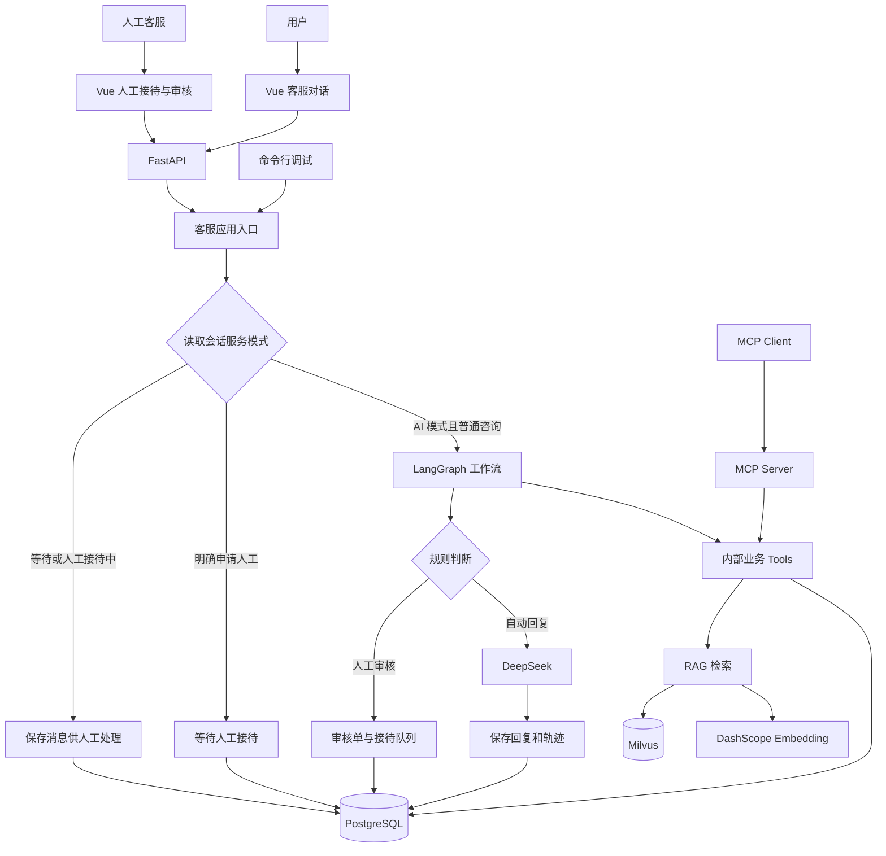

# 小想电商智能客服 Agent 系统：当前版本详细介绍

本文根据 2026-10-10 的本地代码、实际加载的非敏感配置和项目评测报告整理，包含最新的人工客服接管、问候分支及前端工作台。用于理解开发流程、准备项目介绍和面试。

## 1. 项目定位

这是一个面向电商客服场景的 AI 应用原型：普通咨询由程序编排业务查询和政策检索，再根据需要调用大模型组织回复；质量争议、风险问题和明确的转人工请求可以进入人工处理。

它围绕一条客服处理链路组织能力：用户输入、会话恢复、业务查询、政策检索、规则分流、回复生成、人工接管、结果回写和执行记录。

项目名称中的“企业级”描述的是采用了业务分层、数据库持久化、审核和可追踪处理等工程设计。当前仍使用模拟订单和政策，没有完成生产系统所需的登录认证、订单归属校验、完整运维与高并发验证。

当前可以准确概括为：

> 基于 LangGraph 工作流的电商客服 Agent 原型，集成结构化业务查询、Milvus RAG、DeepSeek 回复生成、持久化多轮上下文和人工客服接管，通过 FastAPI 与 Vue 3 提供可交互工作台，并通过 MCP 开放现有查询能力。

## 2. 解决哪些业务问题

| 场景 | 输入示例 | 当前处理方式 |
| --- | --- | --- |
| 问候与致谢 | 你好、在吗、谢谢 | 规则识别后直接回复 |
| 查询订单 | DD10001 多少钱 | 从 PostgreSQL 查询商品、支付金额和状态 |
| 查询物流 | DD10001 物流到哪了 | 查询订单及最新物流记录，组织回复 |
| 售后咨询 | 这个订单可以退货吗 | 结合订单、退款记录和检索到的政策说明 |
| 企业政策 | 发票怎么开 | 可在没有订单上下文时直接走 RAG |
| 质量争议 | 耳机左耳没有声音，我想退款 | 命中规则后创建或复用审核单，并进入人工接待队列 |
| 明确转人工 | 转人工 | 在请求入口直接进入人工接待队列，不要求订单号 |
| 人工回复 | 请提供故障视频 | 客服在接待页面发送消息，自动同步到原会话 |

“退款处理”需要准确理解：当前能够查询售后数据、依据规则分流、记录人工审核和回写回复；没有调用真实支付平台，也没有执行原路退款或实际支付操作。审核单完成不等于已经完成真实退款。

## 3. 技术栈与分工

| 技术 | 项目中的作用 |
| --- | --- |
| Python | 后端、业务工具、工作流和评测 |
| LangGraph | 定义 State、节点和条件边，编排业务流转 |
| LangChain 相关组件 | 模型接入、Embedding、Document 和文本切分 |
| DeepSeek | 将可信业务数据、政策证据和对话上下文组织成自然语言 |
| DashScope text-embedding-v3 | 为文档片段和用户问题生成向量 |
| Milvus / PyMilvus | 保存知识向量和来源，进行余弦相似度检索 |
| PostgreSQL / Psycopg 3 | 保存业务数据、会话、审核和轨迹，支持事务与并发协调 |
| FastAPI / Pydantic | HTTP 接口、参数校验和接口文档 |
| Vue 3 / Vite | 用户聊天及客服管理工作台 |
| Lucide | 前端导航、状态和操作图标 |
| Marked / DOMPurify | Markdown 消息排版及 HTML 安全过滤 |
| MCP Python SDK / FastMCP | 将现有查询函数额外开放为 MCP Tools |
| unittest / Playwright | 规则、检索、接口、数据库并发和浏览器交互验证 |

当前 `config/model.py` 配置的模型标识是 `deepseek-v4-flash`，并配置关闭 thinking。这里描述的是代码配置，不能据此认定历史评测也使用了完全相同的模型版本。

## 4. 总体架构



这里有两个重要的层次：应用入口先决定由 AI 还是人工处理；只有应由 AI 处理的普通消息才进入 LangGraph。转人工和人工聊天不是全部放在图里执行的。

## 5. 项目目录如何分层

| 目录或文件 | 主要职责 |
| --- | --- |
| `frontend/src/App.vue` | 六个工作台页面、用户聊天与会话信息 |
| `frontend/src/LiveSupport.vue` | 人工接待队列、领取、回复与交回 AI |
| `frontend/src/MessageContent.vue` | 消息正文渲染 |
| `frontend/src/messageFormat.js` | 安全 Markdown 与消息摘要 |
| `frontend/src/api.js` | 前端 HTTP 请求封装 |
| `api/app.py` | 创建 FastAPI 应用、注册路由和 CORS |
| `api/routes/` | 聊天、会话、人工接待、审核、轨迹、知识库及系统状态接口 |
| `api/schemas.py` | 请求字段及校验规则 |
| `agent/customer_service_agent.py` | 应用调用入口与图执行封装 |
| `tools/live_support_tool.py` | 按会话状态分流用户消息 |
| `graph/state.py` | 一轮图执行的状态字段 |
| `graph/nodes.py` | 各个节点的具体处理逻辑 |
| `graph/workflow.py` | 节点注册、边及条件路由 |
| `tools/` | 封装订单、物流、退款、知识库等业务能力 |
| `database/` | SQL、数据持久化、接待状态及迁移 |
| `rag/` | 文档加载、切分、向量入库和检索 |
| `config/` | 环境配置及模型、数据库连接构造 |
| `mcp_server/server.py` | MCP 能力出口 |
| `evaluation/` | 题集、评测脚本、评分记录和报告 |
| `tests/` | 功能回归、并发和浏览器测试 |

API 层负责请求与响应，Tool 层负责业务结果封装，Repository 层执行 SQL。工作流将这些业务步骤连接起来，不把所有 SQL、模型调用和 HTTP 逻辑堆在一个接口里。

## 6. 一轮请求的完整链路

### 6.1 请求入口先判断当前由谁服务

用户在前端发送消息时，请求 `POST /chat`，携带 `message` 和 `session_id`。

前端在没有会话编号时生成 UUID 会话编号并保存到 localStorage。其他客户端没有提供编号时，后端也可以生成。后续消息继续使用同一个编号。

入口调用 `customer_service_response()`，再由 `dispatch_customer_message()` 处理。该函数先获取 PostgreSQL 会话锁、创建或恢复会话，并读取 `service_mode`。

```text
service_mode = waiting_human 或 human
  -> 保存用户消息
  -> 返回投递状态，不生成 AI 回复

service_mode = ai，且用户明确申请人工
  -> 保存用户消息
  -> 进入等待接待状态并写入通知

service_mode = ai，且是普通咨询
  -> 调用 LangGraph 工作流
```

这个顺序保证了人工接管后，即使用户输入“你好”或询问政策，也会把消息交给人工，不会被问候分支重新切回 AI。

### 6.2 普通订单类咨询

例如“DD10001 物流到哪了”，当前节点链路是：

```text
start -> parse_message
      -> query_order -> query_logistics -> query_refund -> query_knowledge
      -> build_context -> human_review_check
      -> generate_reply -> finish -> END
```

当前订单链路会串行查询订单、物流、退款和知识库，不是只查询当前意图对应的那个 Tool。这样便于获得完整上下文，也存在多余查询的优化空间。

### 6.3 没有订单上下文的知识问题

例如新会话中的“发票怎么开”：

```text
start -> parse_message -> query_knowledge
      -> knowledge_only_context -> generate_reply -> finish -> END
```

如果政策问题已经继承了历史订单号，当前路由仍可能进入订单类完整链路。这是代码现状，不能说所有知识问题都无条件绕过业务查询。

### 6.4 问候、致谢和简单确认

例如“你好”“在吗”“谢谢”“好的”：

```text
start -> parse_message -> smalltalk_reply -> finish -> END
```

该分支使用规则化回复，不恢复订单号，不调用业务 Tool、Embedding 或 DeepSeek，也不创建审核单。但会保存聊天记录和执行轨迹。

“你好，DD10001 物流到哪了”包含业务问题，不属于纯问候，仍按物流意图处理。

### 6.5 缺少订单号的业务请求

```text
start -> parse_message -> ask_order_no -> finish -> END
```

这适用于需要订单数据但没有订单上下文的请求。因此低置信度未知消息也不是在所有条件下都会自动创建审核单：没有订单号时，当前路由可能先要求订单号。

## 7. LangGraph 节点与 State

当前注册了 14 个节点。

| 节点 | 职责 |
| --- | --- |
| `start` | 创建或恢复会话，保存用户消息，读取最近消息，初始化工具和轨迹列表 |
| `parse_message` | 识别意图，解析当前订单号，必要时恢复历史订单号 |
| `smalltalk_reply` | 对纯问候、致谢、确认和告别进行直接回复 |
| `ask_order_no` | 缺少必要订单上下文时请求补充订单号 |
| `query_order` | 查询订单 |
| `query_logistics` | 查询最新物流记录 |
| `query_refund` | 查询最新退款或售后记录 |
| `query_knowledge` | 召回并过滤政策片段，记录来源 |
| `knowledge_only_context` | 构造无订单查询的政策问答上下文 |
| `build_context` | 汇总订单、物流、退款和知识库结果 |
| `human_review_check` | 按意图、规则置信度和售后记录决定是否审核 |
| `create_human_review` | 创建或复用待处理审核单，进入人工接待队列 |
| `generate_reply` | 检查可用证据，调用模型或进行规则化回复 |
| `finish` | 保存本轮回复与 Agent 执行轨迹 |

`build_fallback_reply()` 是节点内部使用的辅助函数，不是单独注册的图节点。

State 字段可以分成以下几组：

| 分类 | 字段 |
| --- | --- |
| 用户与会话 | `session_id`、`user_message`、`history_messages` |
| 理解结果 | `order_no`、`intent`、`confidence` |
| 查询结果 | `order_result`、`logistics_result`、`refund_result`、`knowledge_result` |
| 汇总上下文 | `context` |
| 审核判断 | `need_human_review`、`review_reason` |
| 执行信息 | `tools_called`、`trace_steps` |
| 最终输出 | `final_action`、`final_reply` |

State 用于一轮执行内部传递信息。跨请求需要恢复的信息来自 PostgreSQL，不是因为声明了 TypedDict 就会自动持久化。

会话服务模式、接待客服和接待轮次保存在 `chat_sessions` 中，不是上述 Graph State 的字段。

## 8. 意图识别与模型职责

### 8.1 当前意图识别方式

当前主要是关键词规则及纯问候表达匹配：

- 发票、开票、抬头、税号等进入知识问题。
- 政策、规则、流程、条件等进入知识问题。
- 退款、退货、换货、售后、坏了、没声音等进入售后意图。
- 物流、快递、到哪、签收、运单等进入物流意图。
- 订单、商品、下单、支付、金额等进入订单意图。
- 纯问候、致谢、简单确认和告别进入 `smalltalk`。
- 没有匹配时为 `unknown`。

当前 `confidence` 是按规则设定的启发式数值，不是经过校准的模型分类概率。关键词判断有先后顺序，因此混合意图和模糊表达仍有改进空间。

### 8.2 程序规则负责什么

程序决定查哪个数据源、节点如何流转、是否需要订单号、是否创建审核单、是否停止 AI 回复、是否拒绝缺少证据的政策回答。

SQL 查询和状态更新由程序执行。订单号使用参数化 SQL 查询，不由模型生成自由 SQL。

### 8.3 大模型负责什么

DeepSeek 接收系统约束、用户问题、近期对话及工具结果，将结构化数据和政策证据组织成礼貌、自然的客服回复。

它不能决定真实订单状态，也没有权限绕过程序直接退款。系统 Prompt 要求基于工具数据，不编造订单、物流、退款或缺少依据的政策。

当前主流程由节点直接调用普通 Python 业务函数，没有使用模型的 `bind_tools` 等原生 Function Calling 来自主决定工具调用。可以介绍为“具备工具调用和状态编排的工作流型 Agent”，不要介绍成已经实现了自主规划的多智能体。

本项目也没有对模型进行 SFT、RLHF 或奖励模型训练。

## 9. PostgreSQL 数据设计

实际加载的业务数据库名称是 `customer_service`。

| 表 | 保存内容 | 主要关联 |
| --- | --- | --- |
| `orders` | 订单号、客户、商品、订单状态、实付金额、付款时间 | `order_no` 唯一 |
| `logistics` | 物流公司、运单号、运输状态、位置、预计送达和更新时间 | `order_no` 外键关联订单 |
| `refund_requests` | 退款单号、类型、原因、状态、金额和人工审核标记 | `order_no` 外键关联订单；退款单号唯一 |
| `chat_sessions` | 会话编号、客户信息、服务模式、接待人、等待与接入时间、接待轮次 | `session_id` 唯一 |
| `chat_messages` | 用户、AI、人工和系统消息，发送人及请求 ID | `session_id` 外键关联会话 |
| `human_reviews` | 审核单号、关联会话与订单、用户诉求、摘要、原因、状态、审核人及回复 | 审核单号唯一；订单和会话为逻辑关联 |
| `agent_traces` | 一轮请求的意图、订单号、工具、动作、最终回复和 JSON 节点步骤 | 通过会话和订单编号逻辑关联 |

订单属于精确、结构化和需要一致性的业务数据，所以使用关系数据库。政策文本需要语义检索，所以另放在向量数据库。

### 9.1 索引和查询

订单号和会话编号的唯一约束同时提供查询索引。人工接待增量迁移还加入了按会话及消息 ID 排序的索引、接待队列索引，以及 `(session_id, client_message_id)` 联合唯一索引。

物流按更新时间取最新记录，退款按创建时间取最新记录，聊天历史按消息 ID 顺序展示。

### 9.2 连接池与事务

当前每次操作通过 `psycopg.connect()` 建立连接，没有使用连接池。

Repository 中 `with get_connection() as conn` 在默认非自动提交模式下，正常退出提交，异常退出回滚。人工领取与接入通知、人工回复与会话更新时间、释放接待与结束通知等关联写入各自共享短事务。

现有审核处理 Tool 先更新审核单，再通过另一个 Repository 写回消息，两步使用不同连接，还没有原子提交；本轮 Agent 轨迹和最终消息保存也没有统一到同一事务。

会话 advisory lock 用于串行协调请求，锁连接采用自动提交。它不等于业务事务，而且在 AI 处理期间会占用连接；并发量上来后需要评估连接池和任务调度。

## 10. 多轮对话与重启恢复

订单上下文恢复主要依靠三步：优先从当前输入解析订单号；对于“这个订单”“多少钱”“退款”“物流”等表达，尝试从近期消息找订单号；仍没有时，从该会话最近一条带订单号的执行轨迹恢复。

例如用户先输入“DD10001 物流到哪了”，下一轮问“那这个订单多少钱”，后端通过相同 `session_id` 找回订单号，再查询最新业务数据。

当前近期消息默认读取 6 条。由于 `start` 先保存当前用户消息再查询近期消息，这个窗口也包含当前输入，不是无限历史。

用户中途明确输入 DD10002 时，当前输入优先，后续轨迹记录新的订单号。纯问候分支不携带订单号，但旧的带订单号轨迹仍然存在，下一轮业务请求可以继续恢复。

服务重启后，数据库里的聊天记录、轨迹和人工接待状态仍在；浏览器保存的会话编号可以继续关联这些数据。

这种恢复是“下一次请求重新读取业务上下文”，没有使用 LangGraph Checkpointer，也不能自动从服务器崩溃前的执行节点续跑。

当前没有独立的跨会话用户画像、偏好记忆或长期记忆检索模块。历史消息持久化不等于已经实现了长期记忆。

`session_id` 是会话定位标识，不是用户身份凭证。缺少身份校验时，知道别人的会话编号仍可能访问其记录，这是生产化前必须补齐的边界。

## 11. 知识库与 RAG

### 11.1 当前规模

本地统计为 10 篇模拟政策文档，共 4,843 个原文字符；当前 500/80 切分得到 14 个片段。历史入库和评测记录中的向量维度为 1024。

文档包括：售后政策、换货维修、耳机故障排查、发票、物流、漏发错发、质量问题、退款、无理由退货和运输破损。

这个规模适合验证处理链路和检索策略，还不能代表真实企业知识库的体量或复杂性。当前项目体量并不要求必须使用 Milvus；选用它也有练习服务化向量检索与独立存储架构的目的。

### 11.2 文档入库

```text
data/knowledge/*.txt
  -> UTF-8 读取
  -> Document：原文 + source/path
  -> RecursiveCharacterTextSplitter
  -> 调用 text-embedding-v3 生成文档向量
  -> 写入 Milvus 的文本、向量和来源
```

实际加载的 Milvus Database 是 `customer_service_kb`，Collection 是 `docs`。写入字段包含 `id`、`text`、`vector`、`source` 和 `path`。

当前入库脚本先生成新向量，然后删除同名旧 Collection、创建新 Collection 并插入新数据。它属于全量重建，没有实现按内容哈希去重的增量更新，也没有政策版本切换和无中断原子发布。

### 11.3 切分策略

切分参数为 `chunk_size=500`、`chunk_overlap=80`，按字符计算。分隔符顺序为段落、换行、句号、分号、逗号和空格。

这属于递归字符切分：优先利用文本边界分割，再按照长度合并；没有调用语义相似度模型来决定分段边界。

500 是保留政策条件和例外、控制输入长度的初始工程值；80 是保留边界上下文的目标重叠。但当前短文档实测 500/0 与 500/80 的切分文本完全相同，实际相邻片段重叠合计为 0，不能说 80 已经带来了效果提升。

### 11.4 在线检索

```text
用户政策问题
  -> 同一个 Embedding 模型生成查询向量
  -> Milvus 按 COSINE 相似度召回 Top 5
  -> 保留 score >= 0.55 的片段
  -> 返回 text/source/path/score
  -> 将证据加入模型上下文
```

最终返回数量为 0 到 5。字段虽然叫 `distance`，在当前 COSINE 配置下采用越高越相似的解释；缺少分数或 NaN 的结果不会作为证据。

订单号、物流状态和退款记录通过 PostgreSQL 精确查询，不进行向量召回。它们与政策检索配合使用，但不因此构成 RAG 多路召回。

当前 RAG 是单路向量召回，没有同时执行 BM25、结果融合、Cross-Encoder Rerank、Multi-Query、HyDE、语义切分或“小块召回后取父块”等策略。

### 11.5 无有效文档时怎么处理

纯知识问题过滤后没有证据时，回复明确说明无法确认政策，将 `final_action` 标为 `knowledge_not_found`，不调用大模型生成政策答案。

订单或物流问题有数据库结果时仍可回答已查询到的事实，政策部分需要说明缺少依据。知识库非空也不自动等于足以回答，Prompt 约束仍只是防护的一部分。

Milvus 不可用和正常检索为空是不同情况。当前检索 Tool 不把数据库或网络异常统一吞掉，异常仍可能传播为接口错误；尚未实现完整的 Milvus 故障降级。

## 12. 已经做过的 RAG 评测

### 12.1 第一轮 Top K 比较

历史报告使用 60 道根据政策构造的题，分成 40 道开发题和 20 道留出题，比较 K=1、3、5、8。当时没有相关性阈值。

另外选取 20 道题，分别生成 K=3 和 K=5 的回答，共 40 份回复。报告记录了接口 Token 用量，并由助手对照原文评分，没有进行独立人工盲评。

在这个生成子集中，平均输入 Token 从 1143.2 增加到 1699.1，增幅约 48.6%。留出生成样本没有显示 K=5 的明确质量优势；生成子集也没有覆盖所有检索失败题。

这说明“召回更多片段”不能直接等同于“最终回答一定更准确”。这些是历史参数与样本的结果，不是当前 0.55 阈值配置的正式回答准确率。

### 12.2 切分与 K 的联合实验

比较切分大小 300、500、800，与重叠 0、80、150，共 9 组切分；每组比较 K=1、3、5、8，共 36 个组合。

使用隔离的 NumPy 精确余弦排序，避免直接重建生产集合。原 60 题作为开发数据，另冻结 20 道场景题检查预先选择的候选。

开发集选出的 300/150/K8 在新题上完整证据覆盖为 14/16，而原切分 500/80/K5 为 15/16，因此没有依据开发成绩就直接切换切分。

800 大于所有当前文档的长度，所以实际上接近整篇短文档检索；该实验不能推导出长文档也应该用 800。

### 12.3 阈值与 K 的联合实验

固定当前 500/80 和 Embedding，复用已保存的向量分数，比较四个 K 值与不设阈值及 0.30 至 0.80 的阈值，共 48 组。

共 80 道已经被查看过的题，其中 66 道库内题、14 道库外题。本轮属于探索数据，没有新的独立留出集。

| K | 阈值 | 完整标注证据题数 | 库内空结果 | 库外仍有结果 | 平均返回字符 |
| --- | --- | --- | --- | --- | --- |
| 3 | 0.55 | 57/66 | 0/66 | 5/14 | 859.2 |
| 5 | 0.45 | 63/66 | 0/66 | 13/14 | 1617.7 |
| 5 | 0.55 | 63/66 | 0/66 | 5/14 | 1316.2 |
| 5 | 0.60 | 61/66 | 1/66 | 2/14 | 983.5 |
| 8 | 0.55 | 66/66 | 0/66 | 5/14 | 1814.1 |

当前采用 Top 5、0.55 是在覆盖、低分片段过滤和上下文长度之间选择的暂定默认值。K=8 覆盖更完整，但上下文更多；0.60 过滤更多库外题，也开始损失库内证据。

不能把 63/66 称为回答准确率。完整证据和条款覆盖依赖金标准标注；库外有片段只是误放行风险代理；字符数也不是 Token 费用。

实测库内和库外 Top1 分数存在交叠，所以单一阈值不能同时保留所有可回答问题并拒绝所有库外问题。后续需要真实问题、新的独立验证集，以及最终回答质量评测。

对应报告为 `evaluation/top_k_report.md`、`evaluation/chunk_grid_report.md` 和 `evaluation/threshold_k_report.md`。报告有缓存、文本快照和可复查的评分明细；复用缓存是结果审计，不是独立重复实验。

## 13. 人工审核与人工客服接管

### 13.1 两套状态各自解决什么问题

人工审核记录“这个风险事项怎么处理”；人工接待记录“这个会话现在由谁回复”。两者分开保存，允许客服在聊天中收集材料，然后在审核页面记录结论。

审核状态包括 `pending`、`completed` 和 `rejected`。会话服务模式为：

```text
ai -> waiting_human -> human -> ai
```

### 13.2 两种进入方式

明确申请人工时，入口直接切换为等待人工，不需要订单号，也不会仅因为“转人工”就创建退款审核单。

图执行中命中审核规则时，节点创建审核单，同时将会话切换到等待接待。纯问候已通过独立分支避开未知意图审核。

### 13.3 接入与双向聊天

客服在“人工接待”查看队列，填写客服名称并领取会话；领取成功后，服务模式变为 `human`，记录接待人和时间。

用户继续发送消息时，入口只保存消息，不运行图或生成 AI 回复。人工发送的回复同样持久化，双方页面约每 1.5 秒轮询更新；后台页面和处理中的刷新会受到前端条件控制。

这是自动同步的近实时聊天，当前没有使用 WebSocket 或 SSE 推送，也没有附件上传和视频材料存储功能。

### 13.4 如何结束人工接待

当前接待客服点击“结束接待，交回 AI”，后端更新会话模式并写入结束通知。下一条用户消息才重新进入 AI 流程。

审核单“处理完成”不会自动释放人工接待；退出浏览器也不会自动结束接待。

### 13.5 并发、过期请求和去重

同一会话的 AI 请求和接待操作使用 PostgreSQL 会话级 advisory lock 协调，避免人工状态更新与正在执行的 AI 轮次交叉。领取会话还使用行锁检查状态，两名不同名称的客服并发领取只有一名成功。

每次进入新的接待轮次增加 `handoff_version`。回复和释放时检查服务模式、接待人和轮次，防止旧页面请求在新一轮接待中写入。

人工消息用 UUID `request_id` 和联合唯一索引去重；当前用户聊天消息尚未接入同样的请求 ID 去重机制。

重复申请人工会复用等待或接待状态。相同会话和订单已有待处理审核单时，创建审核单函数在事务锁保护下复用该单。

客服名称是本地演示身份，不是经过认证的身份。归属检查可以防止普通操作冲突，不能替代登录、可信用户 ID 和 RBAC。

### 13.6 Human-in-the-loop 是暂停还是结束

自动审核分支创建审核单并返回提示后，经过 `finish` 到 `END`，本轮图执行结束。等待人工的状态由数据库维护，工作人员处理期间是业务状态等待，不是 LangGraph 原生暂停。

人工回复和结束操作通过接口完成。用户之后继续提问时启动新一轮图执行，没有使用 `interrupt()`、持久化 Checkpointer 或 `Command(resume=...)` 续跑原图。

## 14. 前端工作台

当前包含六个视图：

| 视图 | 可执行的操作 |
| --- | --- |
| 客服对话 | 新建会话、发送消息、申请人工、查看状态与会话信息 |
| 人工接待 | 全部/等待/我的队列筛选、搜索、领取、回复、交回 AI |
| 人工审核 | 查看待处理单、填写审核人和回复、完成或驳回 |
| 执行轨迹 | 查看每轮意图、最终动作及节点明细 |
| 知识库 | 查看本地文件、测试政策检索、全量重建向量集合 |
| 系统状态 | 检查 PostgreSQL、Milvus 及模型配置 |

最新界面采用紧凑浅色导航和统一图标，区分用户、AI、人工与系统通知；右侧显示服务状态、接待人、消息数量、从消息提取的订单号和近期动态。

模型和人工消息可以渲染 Markdown，HTML 经过 DOMPurify 过滤。用户消息正文保留纯文本显示。手机端收紧导航，并通过侧边详情面板查看会话信息。

系统自检的范围需要准确描述：PostgreSQL 会执行连接查询，Milvus 会检查连接与 Collection；DeepSeek 和 Embedding 当前主要检查配置存在，并没有通过这两个自检项真正发起付费调用。因此“配置存在”不保证 API Key、额度和远端服务一定可用。

## 15. HTTP 接口与 MCP

### 15.1 FastAPI

FastAPI 提供聊天、会话查询、接待队列、审核、轨迹、知识库和系统检查接口，自动生成 `/docs`。

请求模型通过 Pydantic 校验必填字段；人工消息限制长度并校验 UUID，空白人工姓名和消息会被拒绝。通常响应包含 `success`、`message` 和 `data`，人工接待冲突返回 HTTP 409，不存在的会话返回 404，参数问题返回 422。

前端与后端分别运行在 5173 和 8000，属于不同源，因此后端配置允许本地前端来源的 CORS。

接口以同步路由为主，业务库调用也是同步 Psycopg。并发能力仍会受线程池、数据库连接数、外部 API 及会话串行限制影响。

### 15.2 MCP

MCP Server 使用 FastMCP，并额外包装六个工具：

1. `query_order`：查询订单。
2. `query_logistics`：查询物流。
3. `query_refund`：查询退款与售后。
4. `search_knowledge`：检索政策。
5. `list_pending_human_reviews`：查询待审核单。
6. `get_human_review_detail`：查询审核单详情。

服务通过 `mcp.run()` 使用默认 stdio 通信。客户端启动服务进程，通过标准输入输出交换 MCP 的 JSON-RPC 消息，并发现工具名称、说明和参数 Schema。

当前 LangGraph 主流程直接调用内部 Python 函数，MCP 是额外的标准化出口；主 Agent 没有通过 MCP Client 调用这些工具。新人工接待的领取和发送接口也还没有额外封装为 MCP Tools。

项目没有独立的 Skill 执行模块。是否增加 Skill 应根据复用流程和客户端需要决定，而不是因为已经提供了 MCP 就必须增加。

## 16. 异常处理与可观测性

### 16.1 规则化兜底

在 `model.invoke()` 抛出异常时，当前回复节点会根据已查到的订单、物流或退款信息组织规则化回复，标记为 `fallback_reply`。

这覆盖模型调用阶段的异常，尚未覆盖所有失败点。当前 `get_model()` 在该 try 块外，模型初始化或缺失配置异常不一定进入上述兜底。数据库和检索异常也不自动等同于“没有订单”或“没有政策”。

缺少订单时可以返回业务查询未找到的提示；纯知识问题没有证据时返回 `knowledge_not_found`。这些是业务结果，不应该与连接失败混淆。

### 16.2 执行轨迹

节点记录 `trace_steps`，包含节点名称、部分工具执行结果、意图、订单号、知识来源、审核原因和最终动作。`finish` 将整轮数据保存到 PostgreSQL，前端可以查看。

轨迹有助于回答：系统走了哪些节点、订单号从哪里获得、哪个 Tool 失败、为什么转人工、最终是否使用兜底。

当前没有完整记录每个节点的耗时、Token、重试次数或监控指标，也没有正式上线的 P95 延迟和成功率看板。人工聊天和显式转人工在图外处理，不会自动生成一轮同样的 Agent 节点轨迹，但有会话状态和消息记录。

全局错误响应当前可能直接包含底层异常文本，生产环境需要改为内部记录详情、外部返回统一错误信息，并做好敏感数据脱敏。

## 17. 已验证的测试能力

最近一次完整执行 `tests/` 中的 Python 测试为 34 项通过，其中包括实际 PostgreSQL 的隔离 schema 测试。这里的数量不包含另一个 `evaluation/` 目录中的评测脚本测试，也不等于完整产品的所有场景都已验证。

覆盖范围包括：

- RAG 阈值边界、空结果、非法 K、NaN 和真实异常传播。
- 缺少知识证据时不调用模型，保留可用业务事实。
- 问候不查订单、不调用模型、不建审核单，混合业务问句仍正常分类。
- 等待和人工模式不会调用 AI。
- 实际客服接入、双向消息和交回 AI 的接口链路。
- 两名客服并发抢接、旧轮次回复拒绝和重复人工消息去重。
- AI 请求执行中申请人工时，会等待这一轮结束再切换。
- 自动审核进入接待队列并复用待处理审核单。

数据库集成测试创建随机独立 schema，结束后清理，不使用原业务表的数据。

Playwright 还验证了真实用户/客服双窗口聊天、刷新恢复和显式交回 AI。界面测试使用受控测试数据检查六页面在 1440、1024、390 宽度下的布局、队列筛选、手机详情面板及 Markdown 安全过滤，共生成 18 张页面截图。

前端生产构建已通过。上述验证是本地功能和布局验证，没有进行千人并发、长时间稳定性或完整安全审计。

## 18. 部署方式与运行入口

当前开发方式是 Windows 运行 Python、FastAPI 和 Vue，连接虚拟机中 Docker 部署的 PostgreSQL 与 Milvus。Milvus Standalone 基础服务通常还包含 etcd 和 MinIO，这些容器的具体配置由现有虚拟机部署决定。

前端地址：`http://127.0.0.1:5173/`。

后端接口文档：`http://127.0.0.1:8000/docs`。

后端根路径没有专门首页，访问 8000 的 `/` 返回 404 不代表后端没有启动。前端页面由 Vite 服务提供。

首次创建数据库后初始化业务表；已有数据库增加人工接待能力时使用 `python -m database.migrate_live_support`，避免为了增加字段而重新插入演示数据。

知识文件改动后需要重新入库才能改变 Milvus 里的文本和向量；只调整 Top K 或阈值，重启后端即可，不必重建集合。改变切分参数、Embedding 或向量维度时需要重新生成向量并重新验证检索参数。

项目当前没有将前端、后端、PostgreSQL 和 Milvus 全部用一个项目级 Compose 统一部署，不能把基础数据库运行在 Docker 中描述成整个应用已经容器化。

## 19. 可以展示的工程亮点与当前边界

### 可以直接展示的亮点

- 业务数据和政策知识双数据源，避免用模型猜测订单状态。
- 图节点和条件边编排，支持短问候、订单链路、无订单政策和审核分流。
- 数据库恢复多轮订单上下文，记录可复查的处理轨迹。
- 人工审核与人工聊天分离，接管期间停止 AI，并有显式释放机制。
- PostgreSQL 并发协调、归属与轮次检查、人工消息及待处理单去重。
- 通过小样本实验比较切分、Top K 和阈值，保留报告与可复查结果。
- 完整前后端工作台和独立 MCP 查询出口。
- 规则、接口、真实数据库并发及浏览器交互测试。

### 当前还没有完成的能力

- 真实商家订单、物流、支付退款和发票服务接入。
- 登录认证、可信客服身份、RBAC、用户与订单归属校验和租户隔离。
- 长期用户记忆、LangGraph Checkpointer 和原生中断恢复。
- 模型原生 Function Calling、自主规划或多智能体协同。
- BM25 混合召回、Rerank、Query 改写和政策版本管理。
- 连接池、完整跨 Repository 事务、用户消息的请求级去重。
- 完整模型超时、限流、重试、熔断及检索服务故障降级。
- 大规模真实数据评测、正式线上回答准确率和负载测试。
- WebSocket/SSE、客服自动分配、等待超时升级和附件上传。

这些边界可以作为下一阶段计划，不应在简历中提前写成已经完成的成果。

## 20. 如何继续熟悉代码

建议按一轮请求的执行顺序阅读：

1. `frontend/src/api.js` 与 `api/routes/chat.py`：了解消息和会话编号如何传递。
2. `agent/customer_service_agent.py` 与 `tools/live_support_tool.py`：了解谁决定交给 AI 或人工。
3. `graph/state.py` 与 `graph/workflow.py`：先掌握字段、节点和条件边。
4. `graph/nodes.py` 中的 `start`、`parse_message`、`smalltalk_reply`：掌握消息保存、意图及订单恢复。
5. 订单、物流、退款 Tool 和对应 Repository：掌握结构化查询与返回格式。
6. `rag/ingest_knowledge.py`、`rag/retriever.py`：掌握离线入库和在线检索的区别。
7. `build_context`、`human_review_check`、`generate_reply`、`finish`：掌握分流、Prompt、兜底和落库。
8. `database/live_support_repository.py`、`api/routes/support.py`、`frontend/src/LiveSupport.vue`：掌握接管及并发机制。
9. `tools/human_review_tool.py` 与审核 Repository：掌握审核回写及当前事务边界。
10. `mcp_server/server.py`、`evaluation/`、`tests/`：掌握标准化出口、实验依据及验证方式。

阅读时优先回答三个问题：输入数据从哪里来、状态怎么变化、失败时会发生什么。

## 21. 面试时的项目介绍版本

> 我的项目是一个面向电商客服场景的工作流型 Agent 原型。用户可以查询订单和物流、咨询退款售后或企业政策，也可以在同一会话中转接人工客服。
>
> 技术上，我使用 FastAPI 和 Vue 3 提供后端接口及工作台，LangGraph 负责意图解析、业务查询、政策检索、人工审核和回复生成的编排。订单、物流、售后、会话和执行记录保存在 PostgreSQL；企业政策通过 DashScope Embedding 转成向量后放入 Milvus，DeepSeek 结合查到的事实和政策证据组织回复。
>
> 多轮对话通过相同的 session_id，从近期消息和执行轨迹恢复订单上下文。人工部分分成审核工单和会话接管两套状态：用户申请人工或命中风险规则后进入接待队列，客服领取后直接在原会话回复，期间停止 AI，明确结束接待后才恢复自动处理。针对抢接、过期回复和重复消息，我增加了 PostgreSQL 会话锁、接待轮次校验和人工消息去重。
>
> 在 RAG 上，我做过切分、Top K 和阈值的小样本比较，目前暂定 500/80、Top 5 和 0.55 的相关性阈值，并保留实验记录。检索没有有效证据时，纯政策问题会直接说明无法确认，避免让模型补出政策。项目也提供 MCP Server，供其他客户端复用现有查询能力。
>
> 当前已完成本地功能、数据库并发和浏览器验证。它仍是模拟业务原型，尚未接入真实支付、完整身份权限和高并发部署。后续我会重点补充真实数据评测、事务与连接池，以及权限和服务降级。

## 22. 简历表述可以如何更新

建议保留“电商智能客服 Agent 系统”作为项目名，技术栈写 Python、LangGraph、LangChain、FastAPI、PostgreSQL、Milvus、Vue 3 和 MCP。

项目要点可以围绕以下实际工作组织，不把全部实现细节挤成一个长段落：

- 基于 LangGraph 编排订单、物流、售后及政策问答流程，使用 PostgreSQL 恢复多轮订单上下文并记录节点执行轨迹。
- 通过 text-embedding-v3 与 Milvus 构建政策 RAG，对切分、Top K 和相关性阈值进行小样本对照，增加无有效证据的规则化回复。
- 实现审核工单与人工会话接管，使用会话锁、接待轮次及消息请求 ID 处理抢接、过期回复和重复人工消息。
- 使用 FastAPI 与 Vue 3 构建六视图客服工作台，并通过 FastMCP stdio Server 开放六项现有查询能力。
- 编写规则、接口和数据库集成测试，通过浏览器验证双向接待与多尺寸布局；不将本地功能结果表述为生产规模性能指标。

简历中的个人贡献应以自己实际参与、理解并能解释的部分为准。使用 AI 辅助开发并不妨碍展示工程能力，但需要能够讲清具体取舍、错误和验证依据。
